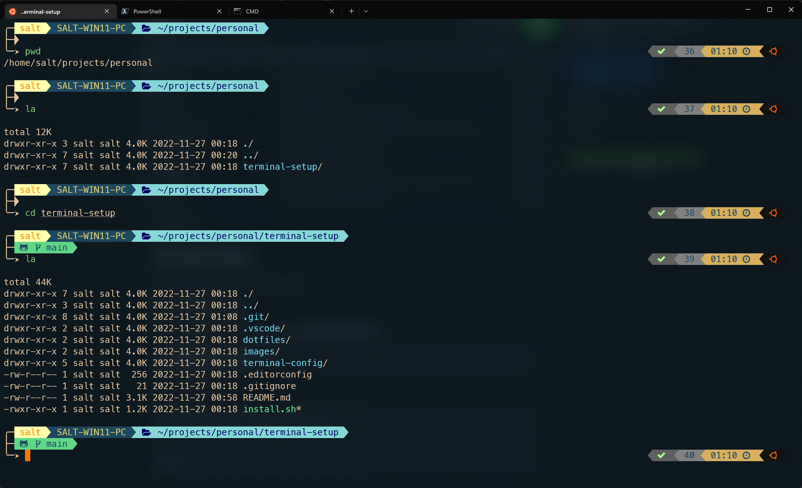

# Terminal Setup

Terminal setup for zsh in macOS, Linux, and Windows.



**For PowerShell configuration, see the [posh config](https://github.com/saltchang/terminal-setup/blob/main/posh/README.md).**

## Clone This Project

It's recommended to put the project under `$HOME/projects/personal`:

```bash
mkdir -p $HOME/projects/personal
cd $HOME/projects/personal
```

Then clone this project:

```bash
# SSH
git clone git@github.com:saltchang/terminal-setup.git
```

```bash
# HTTPS
git clone https://github.com/saltchang/terminal-setup.git
```

## Install Fonts

### Nerd Fonts

Please install at least one of the below fonts for your terminal, [Menlo](https://github.com/ryanoasis/nerd-fonts/releases/download/v2.1.0/Meslo.zip) is recommended.

* [Menlo](https://github.com/ryanoasis/nerd-fonts/releases/download/v2.1.0/Meslo.zip)
* [FuraCode](https://github.com/ryanoasis/nerd-fonts/releases/download/v2.1.0/FiraCode.zip)
* [SourceCodePro](https://github.com/ryanoasis/nerd-fonts/releases/download/v2.1.0/SourceCodePro.zip)

See all [Nerd Fonts](https://www.nerdfonts.com/font-downloads).

### FiraCode

Fira Code is recommended for your editor such as [VS Code](https://code.visualstudio.com).

#### macOS

```bash
brew tap homebrew/cask-fonts
brew install --cask font-fira-code
```

#### Ubuntu/Debian

```bash
sudo apt install fonts-firacode
```

## Install Terminal App

*This is for macOS only*

### macOS

* [iTerm2](https://iterm2.com/)

## Config Terminal

### Config iTerm

1. Open your iTerm > Preferences > Profiles > Other Actions > Import JSON Profiles > Choose this [iTerm Profile](https://github.com/saltchang/terminal-setup/blob/main/terminal-config/iTerm/Salt_iTerm_Profile.json)
2. After you setup: Other Actions > Set as Default
3. Restart iTerm

### Config Windows Terminal

1. Open your Windows Terminal > Settings > Open JSON file
2. Copy json configs from this [config file](https://github.com/saltchang/terminal-setup/blob/main/terminal-config/windows-terminal/windows-terminal-profile.json)
3. Paste the config to the Windows Terminal config json you just opened
4. Restart Windows Terminal

## Install zsh

### macOS

```bash
# Use Homebrew
brew install zsh
```

*Since **Catalina**, macOS will use zsh as the default shell, so you may have zsh built-in in your system*

### Ubuntu/Debian

```bash
sudo apt update && sudo apt -y install zsh
```

### Change zsh to Your Default Shell

```bash
chsh -s $(which zsh)

# Then restart your terminal
```

## Setup the Shell

First, if you're using macOS, please install the coreutils library:

```bash
brew install coreutils
```

To setup the shell, just run the installation script:

```bash
cd terminal-setup

./install.sh
```

It will create a soft link from `~/.zshrc` to the one in this project, check `dotfiles/.zshrc`.

Now restart your terminal or run `source ~/.zshrc`, you should see the new face of the shell.

### Customize Your Shell

Run the below command to open your `.zshrc`:

```bash
edit-rc
```

The you can start to customize your shell.

## Color for powerlevel10k

If you would like to customize the color scheme of powerlevel10k, please see [This chart](https://user-images.githubusercontent.com/704406/43988708-64c0fa52-9d4c-11e8-8cf9-c4d4b97a5200.png).
